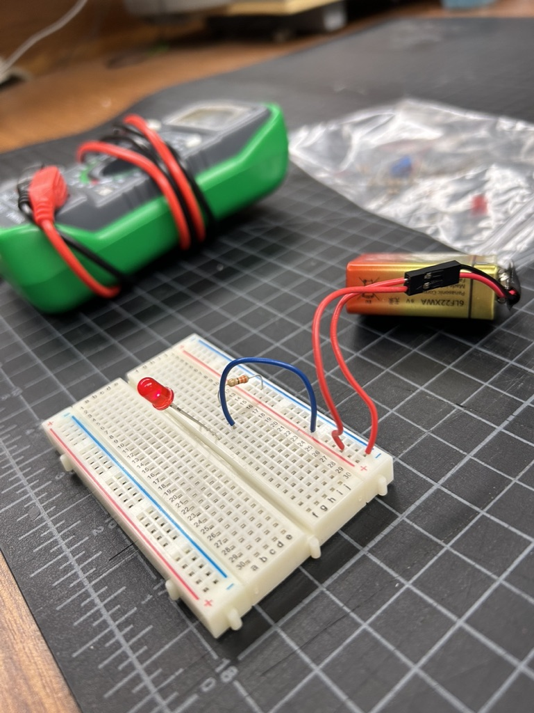
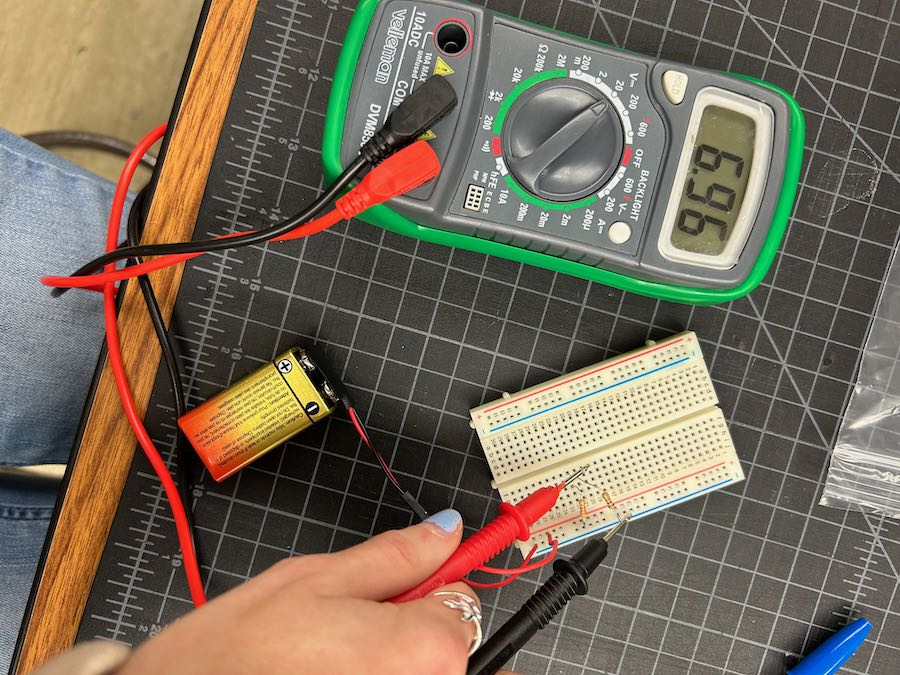

# Week 1 Day 2 Assignment

## Lab 01 The Flashlight

## Electricity 101

Ohm's Law: V = IR
V / I x R

- Volts (V)
- Current (A) or (I)
- Resistance (R)

Volts are pushed out of the battery.
Current are drawing a certain amount of current.

Power Triangle: P = I x E

- Watts (P)
- Volts (E)
- Current (I)

Multimeter: measures them

## Breadboard

numbered lanes are connected to eachother underneath.
lettered lanes are not.
blue stripe & red stripe (+/-) connected all the way over. on each side they're separate. You can connect them though.

## Flashlight Circuit

blue stripe (ground) connecting to resistor connecting to one leg of the led.
black wire connected to blue. red connected to red.
other leg of led connected to another wire conencted to power.

Same column = connected

Big piece of metal inside > negative side
rim. flat end part > negative side
long leg and short leg. short leg > negative side.

Resistor > not polarized. No negative/positive.
Based on Ohms.
Gold stripe > 5% resistor.

| **Value**    | **Color** |
| 0   | Black |
|  1   | Brown |
| 2       | Red  |
|  3  | Black |
| 4  | Yellow|
|  5  | Green |
| 6   | Blue |
| 7  | Violet |
|  8 | Gray |
| 9 | White |

330 Ohm Resistor

Negative sid eof LED goes to resistor. To negative side of breadboard. Positive to positive.

## Lab 02 Voltage Dividers

When you need less volts from a source. Ex: 9 Volt battery but you only need 5 volts.

