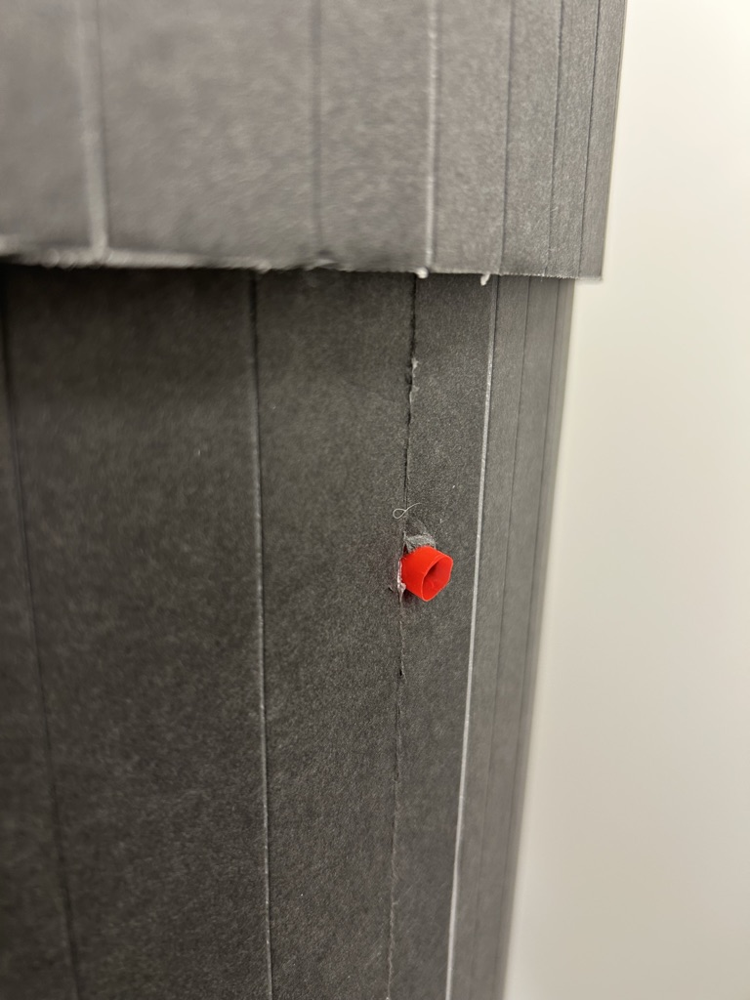
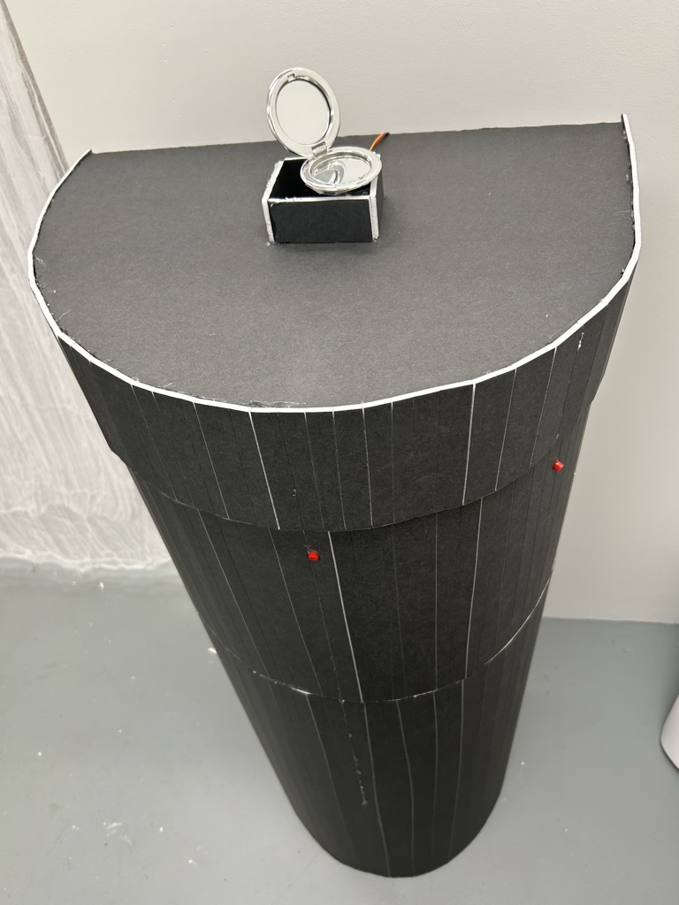
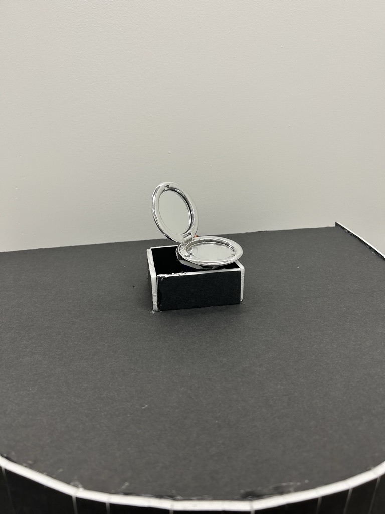

# Midterm Project Progress Update #5

I have 3D printed my mirror holder.
3D printing is incredibly useful, and surprisingly easy. At least the way I did it was easy. I created a file on tinkercad, and then sent it over to the innovation hub. The print itself only took about 3 hours to complete.

(Insert image of print)

Crafting of the mirror holders:
These were incredibly simple.
I made five identical stands in order to hold the flashlights I intend to use to light the sculpture.
The only issue I had while creating them was getting the right angle for the light to shine at the photoresistors. Most of them require an extra sheet of foam in order to have the flashlight be at the right angle.

--

Connecting the servo:

Once I had the code written for the servo, attatching it to the pedastal was really straightforward.
I had the code written, but I was getting confused with the use of an array. So I made it much more complicated and overwritten than it needed to be. After watching the  video Rob made, I had decided to keep my original coding with the adjustment to the minsensor value.
(insert pic of code here)

As for the motor itself, I simply hot glued the base of the servo to a piece of foam and then attached that foam to the top of the pedastal.
Originally, I planned on cutting a hole in the wood, but decided against it for time reasons.

--

Putting the entire project together at this point was not difficult.
I had all the individual pieces, and they all worked together I just had to physically place the photoresistors within their holders and attach the wires to the servo.

Wiring the project:
I made a holder for the breadboard to be attached to the underneath of the top of the pedastal.
I also left the back open for easy access, as it wouldn't be seen anyway.

I had soldered the photoresistor wires, so moving them around and putting them into place was simple.
The servo wires did cause some issues AT one point, the ground wire had fallen out and I couldn't figure out why it wasn't working properly.

I did not have access to a soldering iron before the project was due, so I used the excess ethernet cable wires and attatched them to the arduino and the breadboard, then put hotglue on top to keep them in place. A semi-permanent fix, so that the wires would not continually fall out.

--

The mirror.
After setting up all the wiring and the servo motor, it was finally time to mount the mirror.
Too heavy. Lost my mind over how to fix it. It was also too top heavy which was my fault in the design.

(Insert sketchbook pages of mirror drawings)

I instead used a compact mirror I found and mounted that to the servo by using hot glue.

